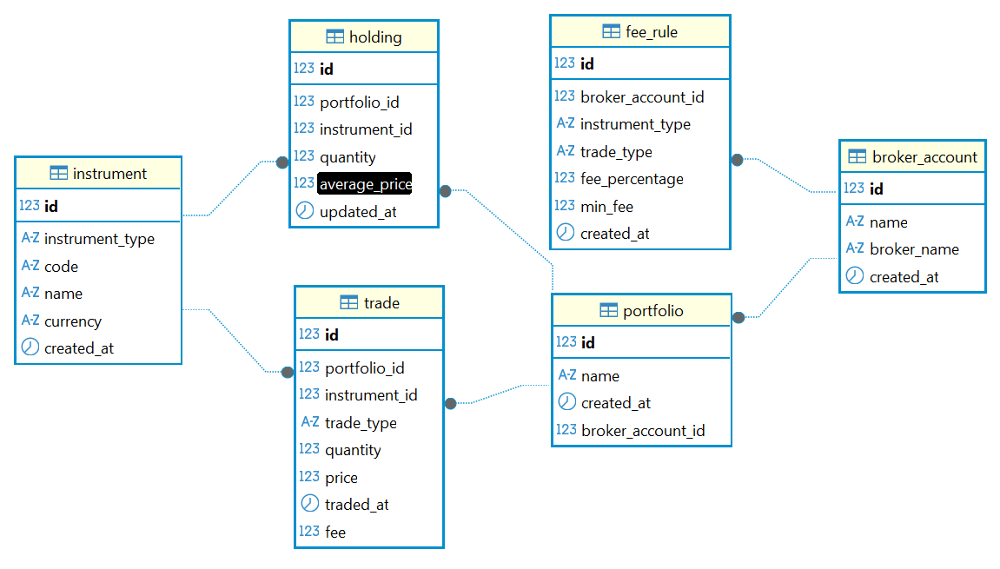

# FinTrackr - Personal Finance Tracking Application


[](https://codecov.io/gh/byanto/fintrackr)


[](LICENSE.md)

---

`FinTrackr` is a modern, robust application designed for comprehensive financial investment management and tracking. Leveraging a microservice architecture, it ensures scalability, resilience, and maintainability. Developed with a modern Java stack, it exposes a comprehensive REST API, facilitating seamless integration with frontend applications and other services.

## Architecture

The project is a multi-module Maven project consisting of several microservices:

* `service-registry`: A Netflix Eureka server that acts as the "phone book" for the system. All other services register here, allowing for dynamic service discovery.
* `api-gateway`: A Spring Cloud Gateway that serves as the single entry point for all external API requests. It handles routing, and is the place for cross-cutting concerns like security and rate limiting.
* `investment-service`: The core microservice responsible for managing all investment-related data, including instruments, portfolios, trades, and holdings.

## Features

- **Portfolio & Instrument Management:** Create and track multiple portfolios and financial instruments.
- **Immutable Trade Log:** Securely record every buy and sell transaction as an immutable event, ensuring data integrity.
- **Automated Holding Calculation:** Automatically calculate and update current holdings (quantity and average price) based on processed trades.
- **RESTful API:** Expose a clean, well-documented, and comprehensive REST API for all core functionalities, enabling seamless integration.

## Technology Stack

- **Backend:** Java 21+, Spring Boot 3.x, Spring Cloud 2025.x
- **Data:** Spring Data JPA, Hibernate, PostgreSQL
- **Database Migrations:** Flyway
- **Containerization:** Docker, Docker Compose, Jib
- **Testing:** JUnit 5, Mockito, AssertJ, Testcontainers
- **CI/CD:** GitHub Actions
- **Code Quality:** JaCoCo, Codecov
- **Dependency Management:** Maven
- **Tooling:** Lombok, MapStruct

## Getting Started

### Prerequisites

- JDK 21 or higher
- Apache Maven 3.8+
- Docker & Docker Compose

### Installation & Running

First, clone the repository and navigate into the directory:
```bash
git clone https://github.com/byanto/fintrackr.git
cd fintrackr
```

This project offers two options to run the application stack, depending on your needs.

#### Option 1: Docker Compose (Recommended)

This is the simplest way to run the entire microservice stack. It uses **Jib** to build container images and **Docker Compose** to orchestrate all services, including the database. 

**1. Build Container Images with Jib**

From the project root, run the following command. `Jib` will compile the code and build an optimized container image for each service directly into your local Docker daemon.

```bash
# From the root directory
mvn compile jib:dockerBuild
docker-compose up -d
```

**2. Start All Services**

Once the images are built, start the entire stack with Docker Compose.

```bash
docker-compose up -d
```

#### Option 2: Local Maven (for Development)

This method is ideal for developing and debugging a specific service directly in your terminal or IDE.

**1. Start the Database**

The `investment-service` requires a PostgreSQL database. A `docker-compose.yml` file is provided for convenience to start it.

```bash
# From the root directory
docker-compose -f investment-service/docker-compose.yml up -d
```

This will start a PostgreSQL container on `localhost:5432`. The application is pre-configured to connect to it. 

**2. Build the application**
    
Build all the microservices using the parent POM file from the project's root directory.

```bash
mvn clean install
```

**3. Run the services**

The services must be started in a specific order to allow for proper registration and discovery. Open a new terminal for each command and run them from the project's root directory:

**a. Start the Service Registry**

```bash
mvn spring-boot:run -pl service-registry
```

Wait for it to start, then you can view the Eureka dashboard at `http://localhost:8761`.

**b. Start the Investment Service**

For local development, it's recommended to activate the `dev` profile, which uses credentials defined in `application-dev.yml`.
    
```bash
mvn spring-boot:run -pl investment-service
# Or, to activate the 'dev' profile for local database credentials:
# Note: The -D argument is quoted to ensure compatibility with all shells (like PowerShell).
# mvn spring-boot:run -pl investment-service "-Dspring-boot.run.profiles=dev"
```
    
The service will be available at `http://localhost:8080`. Ensure your Docker Compose database is running before starting the application.

Alternatively, you can run it without a profile, but you must provide the database credentials as environment variables (e.g., in a production-like environment).

Refresh the Eureka dashboard to see `INVESTMENT-SERVICE` appear in the list of registered instances.

**c. Start the API Gateway**

```bash
mvn spring-boot:run -pl api-gateway
```

Refresh the Eureka dashboard again to see `API-GATEWAY` also registered.

## API Usage

Once all services are running (using either method), following services can be accessed:
- **Eureka Dashboard:** `http://localhost:8761`
- **API Gateway:** `http://localhost:9090` (all API requests should go here)

For example, to get all portfolios, send a request to the `API Gateway`: 

```bash 
curl http://localhost:9090/api/portfolios
```

The gateway will automatically route the request to an available instance of the `investment-service`.

## API Endpoints

The following is a summary of the available API endpoints.

| HTTP Method | Endpoint                               | Description                                     |
|-------------|----------------------------------------|-------------------------------------------------|
| `POST`      | `/api/broker-accounts`                 | Create a new broker account.                    |
| `GET`       | `/api/broker-accounts`                 | Retrieve all broker accounts.                   |
| `GET`       | `/api/broker-accounts/{id}`            | Retrieve a single broker account by its ID.     |
| `PUT`       | `/api/broker-accounts/{id}`            | Update an existing broker account.              |
| `DELETE`    | `/api/broker-accounts/{id}`            | Delete a broker account.                        |
|             |                                        |                                                 |
| `POST`      | `/api/portfolios`                      | Create a new portfolio.                         |
| `GET`       | `/api/portfolios`                      | Retrieve all portfolios.                        |
| `GET`       | `/api/portfolios/{id}`                 | Retrieve a single portfolio by its ID.          |
| `PUT`       | `/api/portfolios/{id}`                 | Update an existing portfolio.                   |
| `DELETE`    | `/api/portfolios/{id}`                 | Delete a portfolio and its associated data.     |
|             |                                        |                                                 |
| `POST`      | `/api/instruments`                     | Create a new financial instrument.              |
| `GET`       | `/api/instruments`                     | Retrieve all instruments.                       |
| `GET`       | `/api/instruments/{id}`                | Retrieve a single instrument by its ID.         |
| `PUT`       | `/api/instruments/{id}`                | Update an existing instrument.                  |
| `DELETE`    | `/api/instruments/{id}`                | Delete an instrument.                           |
|             |                                        |                                                 |
| `POST`      | `/api/trades`                          | Record a new trade (buy/sell).                  |
| `GET`       | `/api/trades`                          | Retrieve all trades.                            |
| `GET`       | `/api/trades/{id}`                     | Retrieve a single trade by its ID.              |
|             |                                        |                                                 |
| `GET`       | `/api/holdings/{id}`                   | Retrieve a single holding by its ID.            |
| `GET`       | `/api/portfolios/{portfolioId}/holdings` | Retrieve all holdings for a specific portfolio. |
|             |                                        |                                                 |
| `POST`      | `/api/fee-rules`                       | Create a new fee rule.                          |
| `GET`       | `/api/fee-rules`                       | Retrieve all fee rules.                         |
| `GET`       | `/api/fee-rules/{id}`                  | Retrieve a single fee rule by its ID.           |
| `PUT`       | `/api/fee-rules/{id}`                  | Update an existing fee rule.                    |
| `DELETE`    | `/api/fee-rules/{id}`                  | Delete a fee rule.                              |

*For a detailed API specification, please refer to the Postman collection or OpenAPI documentation (coming soon).*

## Database Schema

The database schema is managed by Flyway migrations and consists of the following core tables:

- `broker_account`: Stores user-defined broker accounts (e.g., "My Fidelity Account").
- `portfolio`: Represents a collection of investments, linked to a `broker_account`.
- `instrument`: A master list of financial instruments (e.g., stock `BBCA`).
- `trade`: An immutable log of all buy and sell transactions.
- `holding`: A materialized view of the current position (quantity, average price) of an instrument within a portfolio. It is automatically updated when a new trade is processed.
- `fee_rule`: Defines the fee structure for a specific broker, instrument type, and trade type.



## Code Quality & Testing

The project has a comprehensive suite of unit and integration tests. The integration tests use **Testcontainers** to spin up a real PostgreSQL database, ensuring that repository and service-level tests run against a production-like environment.

### Running Tests

To run all tests for the entire project, execute the following command from the root directory:
```bash
mvn test
```

### Code Coverage

Code coverage reports are generated by `JaCoCo`. After running `mvn test`, you can find the HTML report in the following directory: `investment-service/target/site/jacoco/index.html`. Open this file in your browser to view a detailed breakdown of test coverage by package and class.

## Project Motivation & Future Goals

This project was born from a passion for investing and a personal journey of returning to the IT industry after a break since 2016. It serves as a practical showcase of my commitment to learning modern software engineering practices and technologies, specifically within the Java and Spring ecosystem, with the goal of securing a software development role in Germany.

### The Vision

`FinTrackr` is designed with a microservices architecture in mind. The long-term vision includes:
- **Business Service**: A future microservice to track transactions from my e-commerce businesses on platforms like Shopee, Tokopedia, and Lazada.
- **Market Data Service**: A service to fetch and store real-time or historical market data for instruments.
- **Frontend Application**: A modern, user-friendly web interface for interacting with the services.

This project is not just a demonstration of skills but a real-world application that I intend to use and grow over time. It reflects my dedication to continuous learning and my ability to build robust, scalable software.

To learn more about my journey, skills, and other projects, please visit my personal portfolio and blog at [www.budiyanto.com](https://www.budiyanto.com).