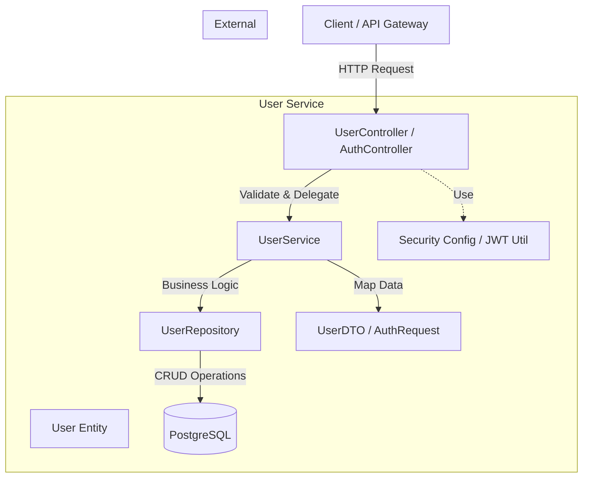

# User Service Architecture

## System Context
The **User Service** is responsible for managing user identities, authentication, and authorization within the FinTrackr ecosystem.

## Component Architecture

## Data Flow (Authentication)
1. **Client** sends `POST /auth/login` with credentials.
2. **AuthController** validates input.
3. **UserService** verifies credentials against **UserRepository**.
4. If valid, **JWT Util** generates a token.
5. **AuthController** returns the token to the **Client**.

## Data Flow (Registration)
1. **Client** sends `POST /users/register` with user details.
2. **UserController** validates input (e.g., email format, password strength).
3. **UserService** checks if user exists via **UserRepository**.
4. **UserService** encodes password and saves **User Entity** via **UserRepository**.
5. **UserService** returns created user details (excluding password).
